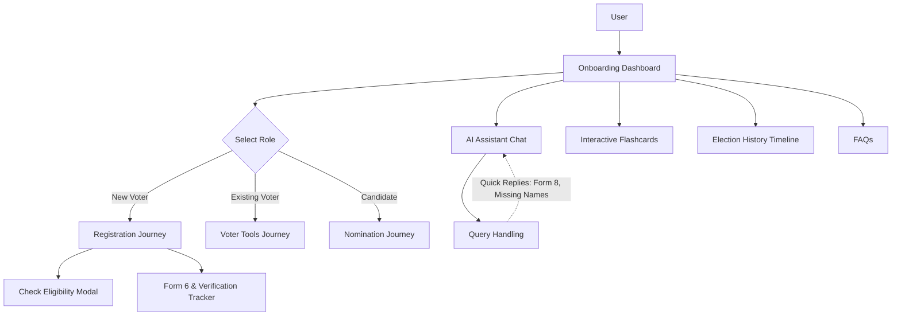

# VAISHALI: Voter Assistance & Information System


**VAISHALI** is an interactive, web-based AI assistant designed to help users understand the Indian election process in a simple, structured, and personalized way. The platform guides users step-by-step based on their role—whether they are a first-time voter, an existing voter, or an aspiring candidate—while providing timelines, eligibility checks, and actionable next steps.

### Why "Vaishali"?
**Vaishali**, an ancient city in present-day Bihar, is celebrated as one of the world's first republics (*Ganatantra*). Dating back to the 6th century BCE, the Licchavi Republic featured an elected assembly, predating many modern democratic constitutions. We chose this name to bridge India's ancient legacy of self-governance with modern civic duty, empowering you to navigate today's electoral process with ease and clarity.

## 🌟 Key Features

1. **Role-Based Guided Flow**: Tailored dashboards for First-Time Voters, Existing Voters, and Candidates.
2. **AI Chat Assistant**: An integrated bot that answers queries about Forms (like Form 6, Form 8), missing names, and polling booth locations using structured, simple language.
3. **Interactive Flashcards**: "Myth vs Fact" flip cards that debunk common misconceptions about Indian elections.
4. **Eligibility Checker**: A quick tool to verify age, citizenship, and residency requirements before applying for a Voter ID.
5. **Modern Government Aesthetic**: A clean, minimalistic UI inspired by the U.S. Web Design System (USWDS), featuring high contrast, flat design, and Times New Roman typography.

## 🏗️ Architecture & User Flow

The application is built entirely as a client-side Single Page Application (SPA) using vanilla web technologies, served rapidly via an Nginx container.



## 🛠️ Technology Stack

- **Frontend**: HTML5, Vanilla CSS3, Vanilla JavaScript (ES6+)
- **Icons**: Lucide Icons
- **Deployment & Hosting**: Docker, Nginx (Alpine), Google Cloud Run
- **Design System**: Flat, minimalistic USWDS-inspired theme

## 🚀 Local Development

Since the application is purely static frontend code, you do not need Node.js or Python to run it locally.

1. Clone the repository:
   ```bash
   git clone https://github.com/adityaaryan848/Voter-Assistance-Information-System.git
   ```
2. Navigate to the project folder.
3. Double-click `index.html` to open it in your web browser.

## ☁️ Cloud Run Deployment

This application is fully dockerized and ready for Google Cloud Run.

1. Authenticate with Google Cloud:
   ```bash
   gcloud auth login
   gcloud config set project [YOUR_PROJECT_ID]
   ```
2. Deploy the service:
   ```bash
   gcloud run deploy vaishali --source . --region us-central1 --allow-unauthenticated
   ```

## 📜 License
This project is built for educational and informational purposes to simplify the guidelines provided by the Election Commission of India.
